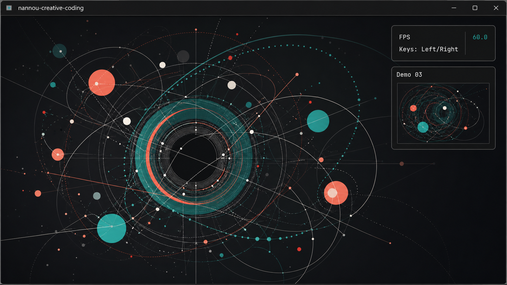
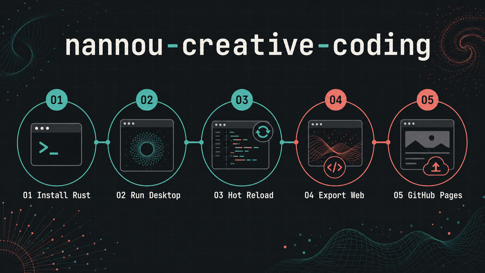

# nannou-creative-coding

Rust workspace for nannou creative-coding sketches, hot-reloadable desktop demos, a static WebAssembly export, and a small read-only MCP helper for agent workflows.

 

## Live Web App

https://samuelasherrivello.github.io/nannou-creative-coding/

The GitHub Pages root redirects to the latest exported static web build. Versioned exports are published under `/releases/<tag>/`.

 

## Pics

### Screenshot

### Infographic

 

## Scripts

### Common

| Command | Required? | Description |
| ------- | --------- | ----------- |
| `.\scripts\main\Install.ps1` | ✅ | Installs or updates Rust through rustup, adds the WebAssembly target, and installs hot-reload and web-export tools when needed. |
| `.\scripts\main\RunDesktopWithHotReload.ps1` | ✅ | Starts the nannou desktop runner and rebuilds the hot-reloadable sketch library as files change. Use `-SkipInstall` after dependencies are ready. |

### Other

| Command | Required? | Description |
| ------- | --------- | ----------- |
| `.\scripts\other\RunDesktop.ps1` | ❌ | Launches the current desktop sketch once with `cargo run -p nannou-creative-coding`. |
| `.\scripts\other\RunWeb.ps1` | ❌ | Builds the WebAssembly app, writes the static site to `target/run-app-web/site`, and serves it on an available localhost port unless `-BuildOnly` is used. |
| `.\scripts\other\RunMcpServer.ps1` | ❌ | Starts the read-only MCP stdio server for project helper tools. |
| `.\scripts\other\ExportGithubPages.ps1` | ❌ | Exports `/latest/` and `/releases/<tag>/` into `target/github-pages/public` for GitHub Pages deployment. |
| `.\scripts\other\IncreaseReleaseVersion.ps1` | ❌ | Increments `VERSION.txt` and Rust crate versions; optional `-Commit` and `-Tag` create the release commit and tag. |

Run commands from the repository root. The desktop window uses `F` to toggle fullscreen and persists fullscreen state, monitor, position, and size to `target/window-state.json`.

 

## Architecture

| Path | Description |
| ---- | ----------- |
| [`rust/crates/main`](./rust/crates/main) | Thin desktop runner, window setup, fullscreen shortcut, persisted window state, and hot-reload callback wiring. |
| [`rust/crates/hot_reload`](./rust/crates/hot_reload) | Hot-reloadable sketch router, shared overlay UI, FPS display, demo list, and demo folders. |
| [`rust/crates/web`](./rust/crates/web) | WebAssembly entrypoint used by the static web export. |
| [`rust/crates/mcp_server`](./rust/crates/mcp_server) | Read-only MCP stdio server with project description, hot-reload target, command list, and screenshot helper metadata. |
| [`rust/patch`](./rust/patch) | Local `nannou_wgpu` patch used by this workspace. |
| [`scripts/main`](./scripts/main) | Setup and primary development workflow scripts. |
| [`scripts/other`](./scripts/other) | Secondary desktop, web, MCP, version, and export scripts. |

Editable sketch code lives in snake_case demo folders under [`rust/crates/hot_reload`](./rust/crates/hot_reload). Use Left and Right arrow keys to switch compiled demos; switching recreates the selected demo state from scratch.

 

## Nannou Features

| Feature | Description |
| ------- | ----------- |
| Hot-reloadable demos | `runcc`, `cargo-watch`, and `hot-lib-reloader` keep the runner alive while the sketch library rebuilds. |
| Demo router | The shared hot-reload crate owns the active demo list, per-demo state recreation, and overlay text. |
| Persistent window state | The desktop runner remembers fullscreen, monitor, position, and size in `target/window-state.json`. |
| Static web export | `RunWeb.ps1` builds `nannou-creative-coding-web` for `wasm32-unknown-unknown` and packages the generated site. |
| Read-only MCP helper | The MCP server exposes project metadata without executing commands or mutating files. |

 

## Github Features

Keep [`.github/workflows/export-github-pages.yml`](./.github/workflows/export-github-pages.yml) as the GitHub Pages deployment workflow. It builds the static site, uploads `target/github-pages/public`, and deploys through GitHub Pages.

Choose one release path:

| Option | Instructions |
| ------ | ------------ |
| Manual release | Run `.\scripts\other\IncreaseReleaseVersion.ps1 -Part patch -Commit -Tag`, push the commit and tag, then publish a GitHub Release for the tag. |
| GitHub Actions release | Run the `PerformRelease` workflow, choose `patch`, `minor`, or `major`, and enter release notes. |
| Local export check | Run `.\scripts\other\ExportGithubPages.ps1 -Version v0.1.1` and inspect `target/github-pages/public`. |

The GitHub Actions display names are `PerformRelease` and `ExportGithubPages`.

 

## Agent Features

| File | Purpose |
| ---- | ------- |
| [`AGENTS.md`](./AGENTS.md) | Repository-specific Codex and agent workflow rules. |
| [`README.md`](./README.md) | Public project workflow, architecture, scripts, live app, and release notes. |
| [`scripts/other/RunMcpServer.ps1`](./scripts/other/RunMcpServer.ps1) | Launches the read-only MCP helper for local project context. |

Agent work should keep script implementations in `scripts/main/` and `scripts/other/`, avoid build output, and make sketch edits in the active snake_case demo folder under `rust/crates/hot_reload/`.

 

## Credits

**Created By**

- Samuel Asher Rivello
- Over 25 years XP with game development (2026)
- Over 10 years XP with Unity (2026)

**Contact**

- Twitter - [@srivello](https://twitter.com/srivello)
- Git - [Github.com/SamuelAsherRivello](https://github.com/SamuelAsherRivello)
- Resume & Portfolio - [SamuelAsherRivello.com](https://www.SamuelAsherRivello.com)
- LinkedIn - [Linkedin.com/in/SamuelAsherRivello](https://www.linkedin.com/in/SamuelAsherRivello)

**License**

License file not yet present in this repository.
